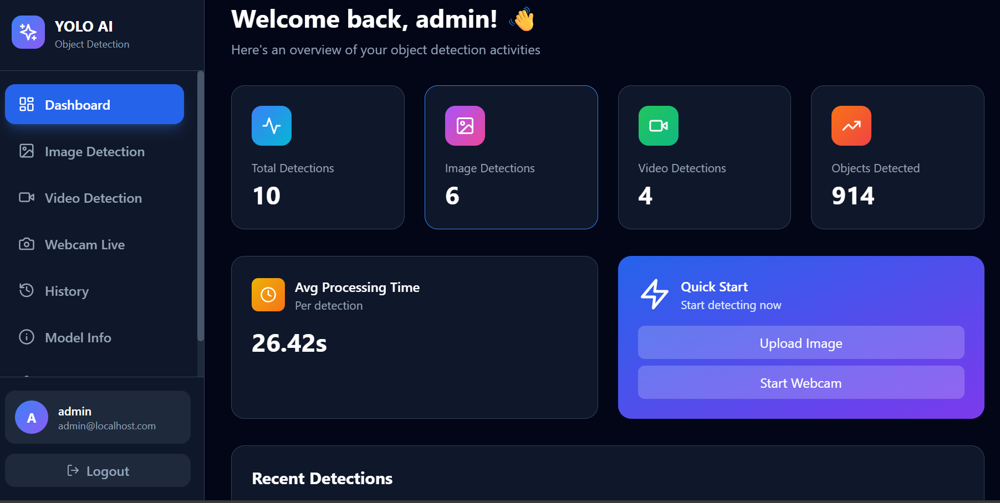
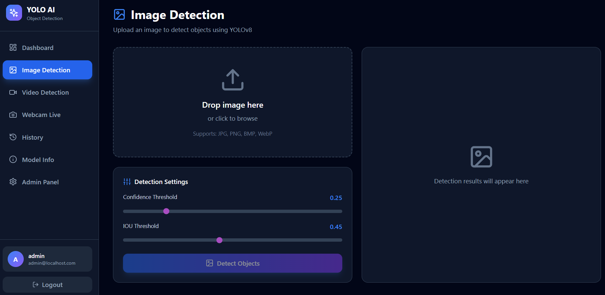
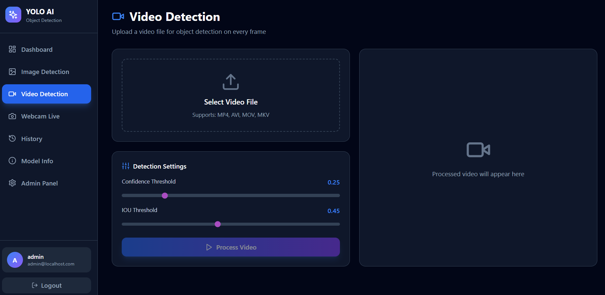
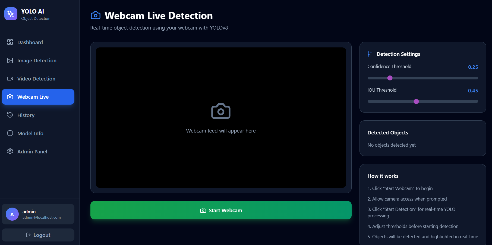
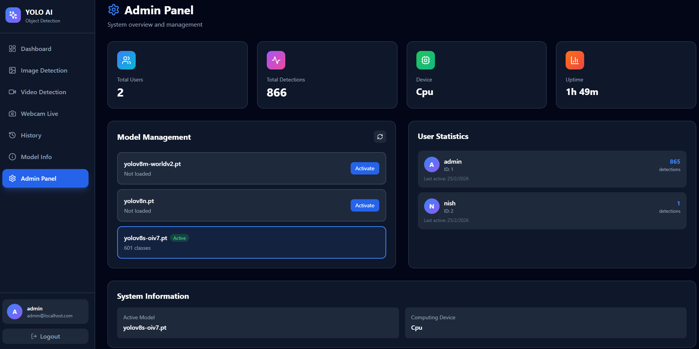
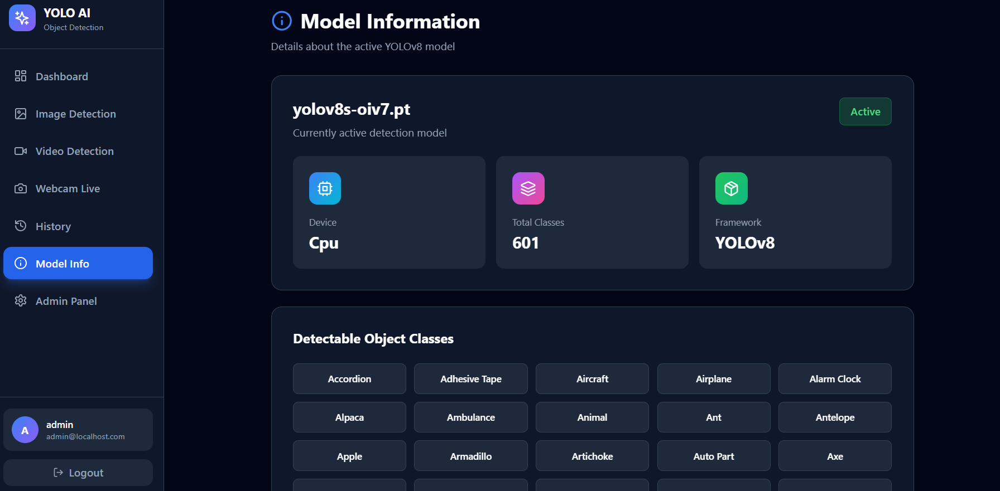
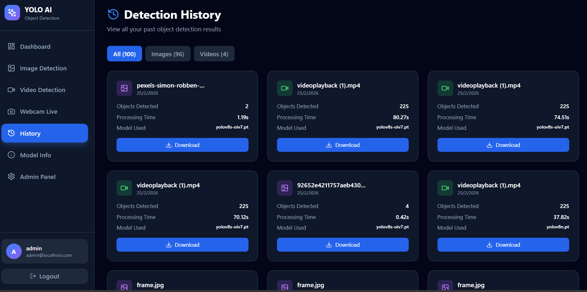

# YOLOv8 Object Detection Web Portal 🚀

A **full-stack web application** for real-time object detection using YOLOv8. Built with FastAPI (Python) backend and React + Tailwind CSS frontend.


## 📖 About

Real-time object detection web application with:
- **Multi-user authentication** with JWT tokens
- **Image & Video Detection** - Upload files for analysis
- **Webcam Live Detection** - Real-time object detection
- **Admin Dashboard** - System management and statistics
- **Modern Responsive UI** - Works on all devices

---

## 🚀 How to Run the Project

### ✅ Prerequisites

- **Python 3.11+** installed
- **Node.js 18+** and npm installed

---

### 📦 Step 1: Create Virtual Environment

```powershell
# Navigate to project root
cd C:\Users\YourUsername\RealTime-Object-Detection-YOLOv8

# Create virtual environment
python -m venv .venv

# Activate virtual environment
.\.venv\Scripts\Activate.ps1
```

✅ You should see `(.venv)` in your terminal prompt

---

### 📦 Step 2: Install Backend Dependencies

```powershell
# With virtual environment activated
pip install fastapi uvicorn[standard] python-multipart ultralytics opencv-python torch torchvision numpy Pillow sqlalchemy alembic python-jose[cryptography] passlib[bcrypt] bcrypt python-dotenv pydantic pydantic-settings psutil aiofiles email-validator
```

**Wait 5-10 minutes** for installation to complete

---

### 📦 Step 3: Install Frontend Dependencies

```powershell
# Navigate to frontend folder
cd frontend

# Install npm packages
npm install

# Return to project root
cd ..
```

**Wait 2-3 minutes** for installation to complete

---

### ⚙️ Step 4: Setup Environment Files

```powershell
# Backend environment file
cd backend
copy ..\.venv\Scripts\Activate.ps1

cd ..

# Frontend environment file
cd frontend
copy .env.example .env
cd ..
```

---

### 🚀 Step 5: Start the Backend Server

**Open a NEW terminal window:**

```powershell
# Navigate to project backend folder
cd C:\Users\YourUsername\RealTime-Object-Detection-YOLOv8\backend

# Start backend with full python path
C:\Users\YourUsername\RealTime-Object-Detection-YOLOv8\.venv\Scripts\python.exe -m uvicorn app.main:app --reload

uvicorn app.main:app --reload

```

**✅ Success indicators:**
```
✅ YOLO model loaded successfully: yolov8n.pt
✅ Device: cpu
✅ Classes: 80
INFO: Application startup complete.
```

**Keep this terminal open!** Backend running on **http://127.0.0.1:8000**

---

### 🌐 Step 6: Start the Frontend Server

**Open ANOTHER NEW terminal window:**

```powershell
# Navigate to frontend folder
cd C:\Users\YourUsername\RealTime-Object-Detection-YOLOv8\frontend

# Start frontend
npm run dev
```

**✅ Success indicators:**
```
VITE v5.4.21 ready in 1000 ms
➜  Local:   http://localhost:3000/
```

**Keep this terminal open!** Frontend running on **http://localhost:3000** or **3001**

---

### 🎉 Step 7: Initialize Admin User

**Open ONE MORE terminal window:**

```powershell
cd C:\Users\YourUsername\RealTime-Object-Detection-YOLOv8

Invoke-RestMethod -Uri "http://localhost:8000/api/auth/init-admin" -Method POST
```

**✅ Expected output:**
```
message                         username
-------                         --------
Admin user created successfully admin
```

---

### 🌟 Step 8: Access the Application

1. **Open your browser** (Chrome or Edge recommended)
2. **Go to:** http://localhost:3000 (or http://localhost:3001 if 3000 was busy)
3. **Login with:**
   - **Username:** `admin`
   - **Password:** `admin123`

---

## 🎯 Quick Start (After First Setup)

Once everything is installed, you only need 2 terminals:

**Terminal 1 - Backend:**
```powershell
cd C:\Users\YourUsername\RealTime-Object-Detection-YOLOv8\backend
C:\Users\YourUsername\RealTime-Object-Detection-YOLOv8\.venv\Scripts\python.exe -m uvicorn app.main:app --reload
```

**Terminal 2 - Frontend:**
```powershell
cd C:\Users\YourUsername\RealTime-Object-Detection-YOLOv8\frontend
npm run dev
```

**Then open:** http://localhost:3000 and login with **admin / admin123**

---

## ✨ Features

### 🎯 Core Detection Features
- **📷 Image Detection** - Upload and analyze images with bounding boxes
- **🎥 Video Processing** - Process entire videos frame-by-frame
- **📹 Webcam Live Detection** - Real-time webcam object detection
- **🔄 Multiple Models** - Switch between different YOLOv8 models
- **📊 Detection Results** - View confidence scores and detected classes
- **💾 Download Results** - Save annotated images and videos

### 🔐 Authentication & Admin
- **User Registration & Login** - JWT-based authentication
- **Admin Dashboard** - System statistics and user management
- **Model Switching** - Change active YOLO models
- **Detection History** - View all past detections

---

## 🛠️ Tech Stack

### Backend
- **FastAPI** - Modern async Python web framework
- **Ultralytics YOLOv8** - Object detection model
- **OpenCV** - Computer vision processing
- **PyTorch** - Deep learning inference
- **SQLAlchemy** - Database ORM

### Frontend
- **React 18** - JavaScript library for UI
- **Vite** - Fast build tool
- **Tailwind CSS** - Utility-first CSS framework
- **Axios** - HTTP client
- **Zustand** - State management

---

## 📁 Project Structure

```
RealTime-Object-Detection-YOLOv8/
├── .venv/                       # Python virtual environment
├── backend/                     # FastAPI Backend
│   ├── app/
│   │   ├── api/endpoints/       # API routes
│   │   ├── core/                # Configuration & security
│   │   ├── models/              # Database models
│   │   └── services/            # YOLO service
│   ├── models/                  # YOLO model files (.pt)
│   ├── uploads/                 # Uploaded files
│   ├── results/                 # Detection results
│   └── .env                     # Backend configuration
├── frontend/                    # React Frontend
│   ├── src/
│   │   ├── components/          # React components
│   │   └── services/            # API client
│   └── .env                     # Frontend configuration
└── README.md                    # This file
```

---

## ❗ Troubleshooting

### Problem: "email-validator is not installed"

**Solution:**
```powershell
# Activate virtual environment first
.\.venv\Scripts\Activate.ps1

# Install email-validator
pip install email-validator
```

### Problem: "uvicorn: command not found"

**Solution:** Always use the full path to Python:
```powershell
C:\Users\YourUsername\RealTime-Object-Detection-YOLOv8\.venv\Scripts\python.exe -m uvicorn app.main:app --reload
```

### Problem: "CORS_ORIGINS validation error"

**Solution:**
```powershell
cd backend
copy .env.example .env
```

### Problem: Port already in use (8000 or 3000)

**Solution:**
```powershell
# Find and kill process on port 8000
netstat -ano | findstr :8000
taskkill /PID <PID_NUMBER> /F

# Find and kill process on port 3000
netstat -ano | findstr :3000
taskkill /PID <PID_NUMBER> /F
```

### Problem: Login shows "incorrect username or password"

**Solution:**
```powershell
# Delete database and reinitialize
cd backend
del yolo_detection.db
cd ..
Invoke-RestMethod -Uri "http://localhost:8000/api/auth/init-admin" -Method POST
```

### Problem: Webcam not detecting objects

**Solutions:**
1. Lower confidence threshold to 0.15 or 0.10
2. Ensure good lighting
3. Point camera at common objects (person, phone, laptop, cup)
4. Check browser console (F12) for errors
5. Verify backend is running (visit http://127.0.0.1:8000/docs)

### Problem: Frontend shows "Network Error"

**Solution:**
1. Verify backend is running on port 8000
2. Check backend terminal for errors
3. Open http://127.0.0.1:8000/docs to verify backend is accessible

---

## 🎊 You're All Set!

Enjoy using the YOLOv8 Object Detection Web Portal! 🚀

**Quick Tips:**
- Use **good lighting** for better webcam detection
- Point camera at **common objects** (person, phone, laptop, bottle)
- Try **different confidence thresholds** (0.25 is default)
- Check **History** page to see all past detections
- Use **Admin Panel** to monitor system stats

---

## 📸 Screenshots

### Dashboard


### Image Detection


### Video Detection


### Webcam Detection


### Admin Panel


### Model Info


### Detection History

## 📄 License

This project is licensed under the MIT License - see [LICENSE](LICENSE) file for details.

## 🙏 Acknowledgments

- [Ultralytics YOLOv8](https://github.com/ultralytics/ultralytics) - Object detection model
- [FastAPI](https://fastapi.tiangolo.com/) - Backend framework
- [React](https://react.dev/) - Frontend library
- [Tailwind CSS](https://tailwindcss.com/) - CSS framework


## 🗺️ Roadmap

- [ ] WebSocket support for real-time webcam detection
- [ ] Model training interface
- [ ] Multiple file batch processing
- [ ] Export detection data (CSV/JSON)
- [ ] Mobile application (React Native)
- [ ] Video streaming support (RTSP)
- [ ] Custom model upload and management
- [ ] API rate limiting
- [ ] User usage quotas
- [ ] Email notifications

## ⭐ Show Your Support

If you find this project useful, please consider giving it a star on GitHub!

---

**Built with ❤️ using YOLOv8, FastAPI, and React**

**Version:** 2.0.0 | **Last Updated:** February 2024
